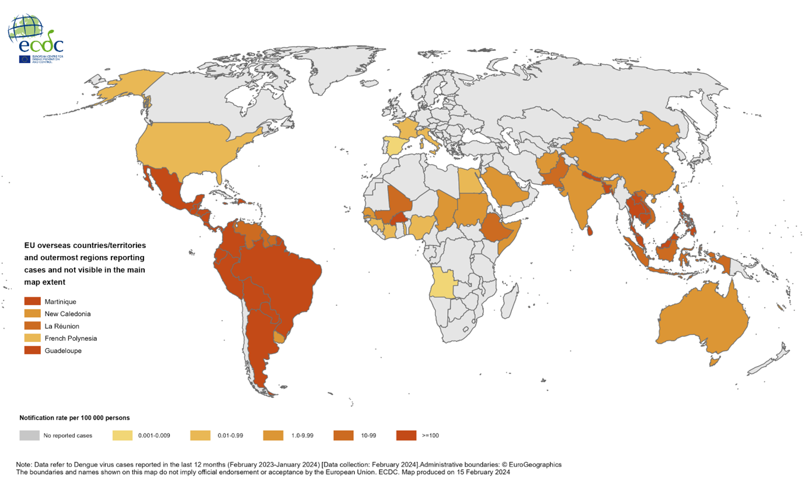

# Comparison of Bioinformatic Approaches for Minimizing Sequence Redundancy in Amplicon Sequencing Data from Oxford Nanopore Technology Platforms Applied to Dengue Virus Research

## Abstract
This study aims to evaluate bioinformatic methods to reduce sequence redundancy in Oxford Nanopore Technology (ONT) amplicon sequencing of microbial communities, with a particular focus on dengue virus. The study addresses the challenge of high error rates by comparing clustering and denoising techniques to improve sequence robustness, which is critical for molecular epidemiology. The objective of this research is to enhance ONT's capability in various fields, with the potential to impact public health strategies in regions affected by dengue due to climate change.

## Introduction
### Dengue Virus
Dengue virus, also known as "break-bone fever," is a viral infection that spreads to humans through Aedes Aegypti or Aedes Albopictus mosquitoes. It is mostly found in tropical and subtropical climates and can be found in regions such as Eastern Mediterranean, American, South-East Asian, Western Pacific and Africa. Dengue epidemics have a significant impact on the health services, families, and economy of affected countries [1]. Though dengue mainly affects tropical regions, it's now rapidly spreading in European countries with warmer weather such as Croatia, France, Israel, Italy, Portugal, and Spain [2]. This mosquito-borne disease can cause fever, headaches, fatigue, and can be fatal, with up to 40,000 deaths reported each year [3]. Most of the cases or small outbreaks occur due to travelers who are infected abroad and bring the virus back. However, this year, warm weather conditions and an increase in the number of imported cases have led to a surge in local infections carried by tiger mosquitoes, which inhabit southern Europe [4].

The term ‘dengue viruses’ refers to four genetically and antigenically related viruses that are known as serotypes 1–4, each of them grouped into genotypes. Infection by any of the four serotypes can result in a range of clinical manifestations, and the timing or sequence of infections can be an important determinant of disease severity and course. Dengue illness is clinically classified as either dengue with or without warning signs or severe dengue [5].

  Dengue virus disease case February 2023 - January 2024

### ONT

## Methods

## Result

## Reference
1.	Nature. 2016. Global spread of dengue virus types: mapping the 70 year history. [Online] Available at: https://www.nature.com/articles/nrdp201655
2.	Nature. 2023. How climate change is making dengue fever worse. [Online] Available at: https://www.nature.com/articles/d41586-023-03407-6
3.	PMC. 2000. Dengue and dengue hemorrhagic fever. [Online] Available at: https://www.ncbi.nlm.nih.gov/pmc/articles/PMC10715994/
4.	WHO. 2023. Disease outbreak news on dengue in EU countries. [Online] Available at: https://www.who.int/emergencies/disease-outbreak-news/item/2023-DON498
5.	ECDC. 2023. Dengue worldwide overview. [Online] Available at: https://www.ecdc.europa.eu/en/dengue-monthly
