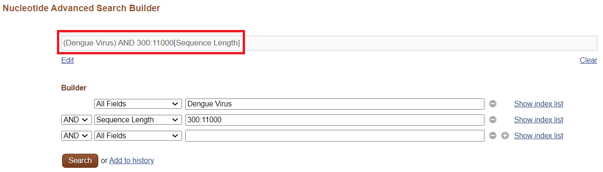

# Title
## High Level Guide to Using the Scripts

### Configuration: `00.config.sh`
Please update the script with your specific settings where you see the comment "## adjust". Ensure these settings align with your project requirements.

### Fetching NCBI Data: `01.fetch_NCBI.sh`
Modify the sections marked as "## adjust" to suit your research needs. When you reach the portion of the script that says, "# Perform the search to get dengue virus sequences. Adjust the search term as needed," refer to the instructions provided below.

To tailor the search query for your need, use the NCBI Nucleotide Advanced Search Builder. The image below (Figure 1.1) illustrates the Advanced Search Builder interface, which you can access at the following URL: [NCBI Nucleotide Advanced Search Builder](https://www.ncbi.nlm.nih.gov/nuccore/advanced).

In the Advanced Search Builder, adjust the search parameters as necessary. Your configured parameters will reflect in the search details field, as highlighted in Figure 1.1.

## Pre-requisite/Dependencies
The following module, environment, and packages are needed in this project:
* Module: 
  * Anaconda
* Environment:
  * Conda Environment
* Packages:
  * Entrez Direct (EDirect)
